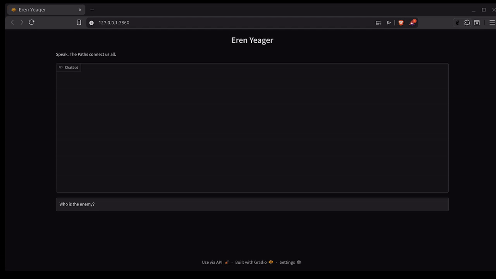

# Eren Yeager Chatbot


## Demo
A high-fidelity, immersion-focused roleplay chatbot that lets you converse with **Eren Yeager** from *Attack on Titan* (Season 4 — Paths / Founding Titan era).

This project runs **locally** and uses:

- **Groq** + **Llama 3** for extremely fast, low-cost inference  
- **Gradio** for a clean, modern chat interface  
- A powerful, externalized system prompt kept in `summary.txt` to strictly preserve character accuracy and prevent breaking roleplay

## Key Features

- **Deep character fidelity** — Eren stays in character at all times (controlled via `summary.txt`)
- **Safe Mode** — Gracefully handles missing API keys or config files without crashing
- **Request queuing** — Supports multiple users / tabs even with a single Groq API key (avoids rate-limit errors)
- **Very low latency** — thanks to Groq's LPU inference
- **Easy to modify** — prompt lives in a plain text file → no need to touch code to tune personality
- **Modern Python stack** — built around `uv` for fast & reproducible environments

## Quick Start

### Prerequisites
- Python **3.9** or higher
- [uv](https://github.com/astral-sh/uv) installed
- A free **Groq API key** → [https://console.groq.com/keys](https://console.groq.com/keys)

### Installation

1. **Clone the repository**

   ```bash
   git clone https://github.com/ThePeruCoder/eren-chatbot.git
   cd eren-chatbot
2. **Sync dependencies**
   (This command automatically creates the virtual environment and installs dependencies from `uv.lock`)

   ```bash
   uv sync
3. **Add your Groq API key**
   Create a file named `.env` in the project root:

   ```bash
   GROQ_API_KEY=gsk_xxxxxxxxxxxxxxxxxxxxxxxxxxxxxxxxxxxxxxxxxxxx
4. **Run**

   ```bash
   uv run main.py
   ```
 Open the local URL shown in the terminal (usually http://127.0.0.1:7860)

## Character Behavior

All personality, tone, worldview, memories, and response style rules are defined in [`summary.txt`](summary.txt).

You can:

- Edit it to adjust Eren's mood, vocabulary, aggression level, etc.
- Add new memories / events without changing code
- Strengthen / weaken certain traits (freedom obsession, rage, manipulation, etc.)

The bot **will refuse** to break character or act like a generic assistant.

## Tech Stack

| Component       | Technology             | Purpose                              |
|-----------------|------------------------|--------------------------------------|
| Backend / LLM   | Groq + Llama 3         | Fast & cheap inference               |
| Frontend        | Gradio                 | Clean chat UI                        |
| Env vars        | python-dotenv          | Secure API key handling              |
| Deps / env      | uv                     | Blazing fast package & venv manager  |
| Concurrency     | Internal queue         | Rate-limit friendly multi-user       |

## Project Structure

```
eren-chatbot/
├── main.py                  # Application entry point
├── summary.txt              # Core system prompt — edit this!
├── .env                     # (create yourself) API keys live here
├── pyproject.toml           # Project metadata
├── uv.lock                  # Reproducible dependencies
├── .gitignore
└── README.md
```

## Notes & Limitations

- Requires internet access (Groq API)
- Free Groq tier has rate limits → queuing helps but heavy multi-user usage may still hit them
- No built-in chat history persistence (yet)
- No authentication — do **not** expose publicly without adding security

## 📜 License

This project is licensed under the MIT License - [LICENSE](LICENSE)

